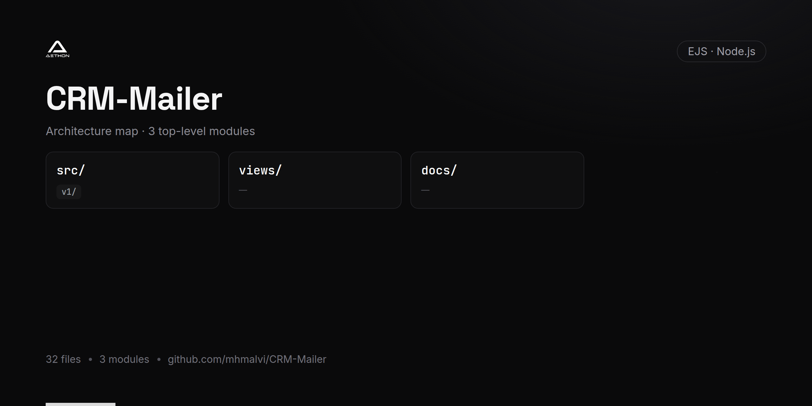

<!-- repo-card -->




# CRM Mailer Service

An email marketing and transactional mail microservice within the CRM ecosystem that handles lead lifecycle emails, payment confirmations, and user registration notifications. Built with EJS templates and Nodemailer, this service delivers professionally branded emails triggered by CRM events.

## Overview

The CRM Mailer Service is responsible for sending event-driven emails across the CRM platform. It covers the full lead lifecycle — from initial lead creation through skill assessment, payment processing, verification, and completion — as well as user registration welcomes and payment receipt emails. All emails are rendered using EJS templates with dynamic data injection.

## Key Features

- **Lead Lifecycle Emails** — Automated emails triggered by lead status changes (new lead, skilled, paid, verified, completed, canceled)
- **Payment Confirmation Emails** — Detailed payment receipts with invoice data, company branding, and transaction details
- **Registration Emails** — Welcome emails with credentials for newly registered users
- **Response Tracking Emails** — Notification emails triggered by lead response/call events
- **EJS Templating** — Dynamic, data-driven email templates with company logos and branding
- **Multi-Recipient Support** — Send emails to multiple recipients per event
- **SMTP Integration** — Email delivery via Gmail SMTP through Nodemailer
- **Versioned API** — Clean v1 API structure for maintainability

## Tech Stack

- **Runtime:** Node.js
- **Framework:** Express.js
- **Email Transport:** Nodemailer (Gmail SMTP)
- **Templating:** EJS (Embedded JavaScript)
- **Environment Config:** dotenv

## API Endpoints

All endpoints are prefixed with `/api`.

| Method | Endpoint                       | Description                                      |
|--------|--------------------------------|--------------------------------------------------|
| POST   | `/api/send-mail`               | Send lead status change email                    |
| POST   | `/api/send-payment-mail`       | Send payment confirmation with invoice details   |
| POST   | `/api/send-registration-mail`  | Send welcome/registration email with credentials |
| POST   | `/api/send-responded-mail`     | Send lead response/call notification email       |

### Request Payloads

**POST `/api/send-mail`**
```json
{
  "lead_status": 1,
  "name": "John Doe",
  "student_id": 123,
  "lead_id": 456,
  "response": 0,
  "logo": "path/to/logo.png",
  "client": "Company Name",
  "course": "Course Name"
}
```

Lead status values: `1` = New Lead, `2` = Skilled, `4` = Paid, `5` = Verified, `6` = Completed, `7` = Canceled

**POST `/api/send-payment-mail`**
```json
{
  "data": "{\"invoice_id\":\"INV-001\",\"transaction_id\":\"TXN-001\",\"company_name\":\"Acme Corp\",\"payment_amount\":500,\"payment_method\":\"card\",\"payer_name\":\"John Doe\",\"payer_email\":\"john@example.com\"}"
}
```

**POST `/api/send-registration-mail`**
```json
{
  "email": "newuser@example.com",
  "full_name": "John Doe",
  "password": "generated_password"
}
```

## Email Templates

| Template                | File                       | Purpose                                     |
|-------------------------|----------------------------|---------------------------------------------|
| Lead Status             | `views/skilled.ejs`        | Lead lifecycle status change notifications  |
| Payment Confirmation    | `views/payment_complete.ejs`| Payment receipt with invoice details       |
| Registration Welcome    | `views/registration_mail.ejs`| New user welcome with credentials         |
| Response Notification   | `views/response.ejs`       | Lead response/call event notifications      |

## Prerequisites

- Node.js (v14 or higher)
- Gmail account with App Password configured (or equivalent SMTP provider)

## Setup & Installation

1. **Clone the repository:**
   ```bash
   git clone https://github.com/mhmalvi/CRM-Mailer.git
   cd CRM-Mailer
   ```

2. **Install dependencies:**
   ```bash
   npm install
   ```

3. **Start the service:**
   ```bash
   npm start
   ```

   The service will start on port **2000** by default.

## Project Structure

```
CRM-Mailer/
├── index.js                          # Application entry point
├── src/
│   └── v1/
│       ├── router/
│       │   └── router.js             # API route definitions
│       ├── controllers/
│       │   └── Mail-controller.js    # Email sending logic
│       └── models/
│           └── Mail.js               # Mail model
├── views/
│   ├── skilled.ejs                   # Lead status email template
│   ├── payment_complete.ejs          # Payment confirmation template
│   ├── registration_mail.ejs         # Registration welcome template
│   └── response.ejs                  # Response notification template
├── public/
│   ├── images/                       # Email assets (logos, social icons)
│   └── register_images/              # Registration email assets
└── package.json
```

## Architecture

This service is part of a larger **CRM microservices architecture**. It serves as the marketing and lifecycle email delivery service, triggered by events from the Lead Management, Payment, and Authentication services. It operates independently with its own templates and SMTP configuration, and can be deployed and scaled based on email volume requirements.

## License

ISC
